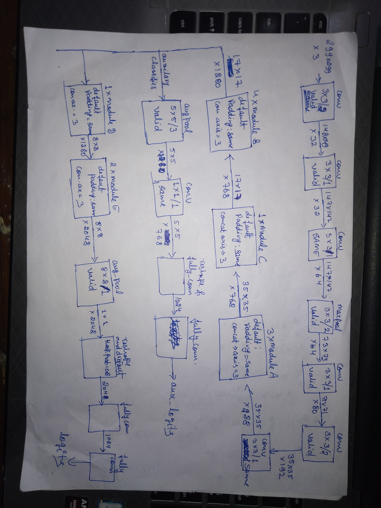
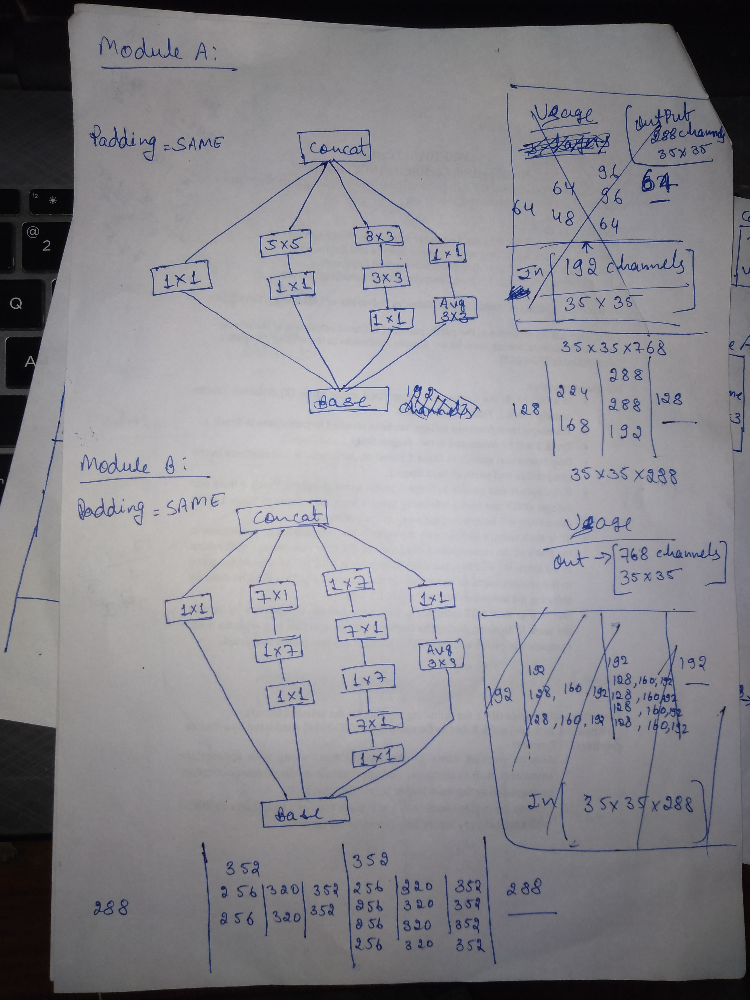
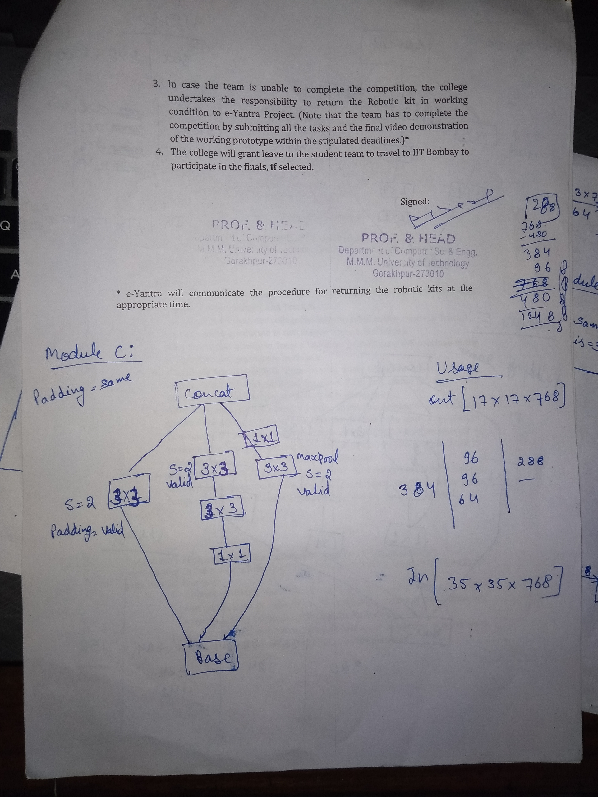
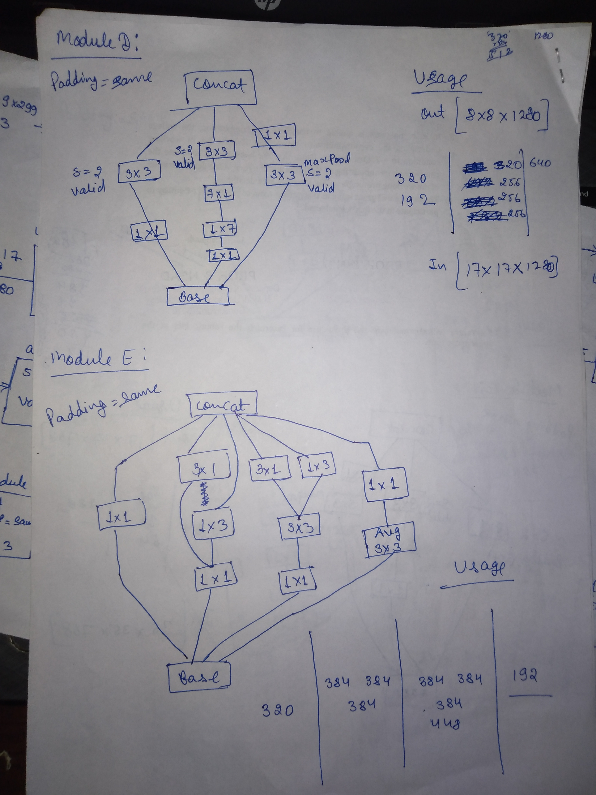

# Inception V3
### This repository is a Tensorflow implementation of Convolutional Neural Network model, Inception V3, published as research 
named as ["Rethinking the Inception Architecture for Computer Vision"](https://arxiv.org/abs/1512.00567) with cetain modifications.

## Following is the execution graph (hand crafted) :

## Following are the inception modules used in the graph:

